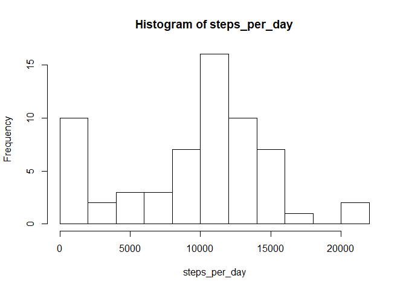
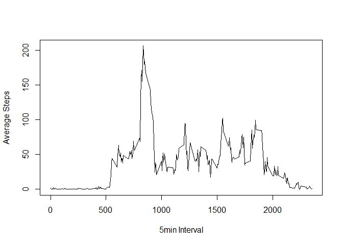
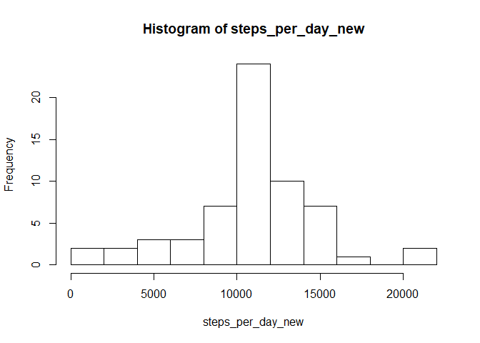
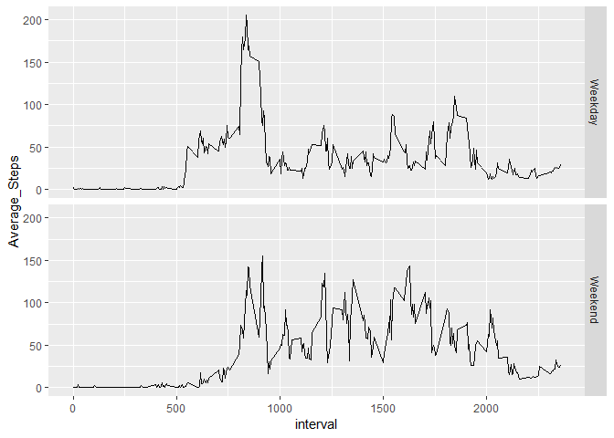

## Loading and preprocessing the data


```r
library(dplyr)
```

```
## 
## Attaching package: 'dplyr'
```

```
## The following objects are masked from 'package:stats':
## 
##     filter, lag
```

```
## The following objects are masked from 'package:base':
## 
##     intersect, setdiff, setequal, union
```

```r
library(ggplot2)
```

```
## Warning: package 'ggplot2' was built under R version 3.5.2
```

```r
activity <- read.csv("activity.csv")
```


## 1. What is mean total number of steps taken per day?

### 1.1 Calculate the total number of steps taken per day. PS. Showing sample of result

```r
steps_per_day <- tapply(activity$steps,activity$date,sum,na.rm=TRUE)
head(steps_per_day)
```

```
## 2012-10-01 2012-10-02 2012-10-03 2012-10-04 2012-10-05 2012-10-06 
##          0        126      11352      12116      13294      15420
```

### 1.2 Make a histogram of the total number of steps taken each day

```r
hist( steps_per_day, breaks = 10 )
```

<!-- -->

### 1.3 Calculate and report the mean and median of the total number of steps taken per day

```r
steps_per_day_mean <- mean(steps_per_day)
steps_per_day_median <- median(steps_per_day)
```

The mean is 9354.2295082 and the median is 10395


## 2. What is the average daily activity pattern?

### 2.1 Make a time series plot of the 5-minute interval (x-axis) and the average number of steps taken, averaged across all days (y-axis)

```r
steps_per_5min <- tapply(activity$steps,activity$interval,mean,na.rm=TRUE)
plot(names(steps_per_5min),steps_per_5min,type="l",ylab = "Average Steps",xlab="5min Interval")
```

<!-- -->

### 2.2 Which 5-minute interval, on average across all the days in the dataset, contains the maximum number of steps?
The five minute interval which contains the maximum number of steps is the the number 835


## 3.Imputing missing values
### 3.1 Calculate and report the total number of missing values in the dataset 
There are  2304 misssing values out of the 17568 rows

### 3.2 Devise a strategy for filling in all of the missing values in the dataset. The strategy does not need to be sophisticated. For example, you could use the mean/median for that day, or the mean for that 5-minute interval, etc.
The strategy will be to use the mean for that 5min interval since it seems more intuitive.

### 3.3 Create a new dataset that is equal to the original dataset but with the missing data filled in.

```r
nacases<-activity[!complete.cases(activity),]
steps_per_5min<-as.data.frame((steps_per_5min))
steps_per_5min$interval=rownames(steps_per_5min)
names(steps_per_5min)<-c("interval_avg_steps","interval")
na_with_replacement_vector<-merge(nacases,steps_per_5min, by="interval")
na_with_replacement_vector<-arrange(na_with_replacement_vector,date,interval_avg_steps)
activity_new <- activity
activity_new[!complete.cases(activity),]$steps<-na_with_replacement_vector$interval_avg_steps 
```

### 3.4  Make a histogram of the total number of steps taken each day and Calculate and report the mean and median total number of steps taken per day. Do these values differ from the estimates from the first part of the assignment? What is the impact of imputing missing data on the estimates of the total daily number of steps?

```r
steps_per_day_new <- tapply(activity_new$steps,activity_new$date,sum,na.rm=TRUE)
hist( steps_per_day_new , breaks = 10 )
```

<!-- -->

```r
steps_per_day_mean_new <- round(mean(steps_per_day_new),2)
steps_per_day_median_new <- round(median(steps_per_day_new),2)
```

The new mean is 10766.19 and the median is 10766.19
The results after imputing the missing values are very different since there are no more days with 0 steps which seems to have distorted the first analysis. The new result is much closer to a normal curve as well.


## 4. Are there differences in activity patterns between weekdays and weekends?

### 4.1 Create a new factor variable in the dataset with two levels - "weekday" and "weekend" indicating whether a given date is a weekday or weekend day.

```r
activity_new$date<-as.Date(activity_new$date)
activity_new$day_type_flag<-weekdays(activity_new$date) %in% c("Saturday", "Sunday")
activity_new$day_type<-as.factor(activity_new$day_type_flag)
levels(activity_new$day_type)[levels(activity_new$day_type)=="TRUE"] <- "Weekend"
levels(activity_new$day_type)[levels(activity_new$day_type)=="FALSE"] <- "Weekday"
```


### 4.2 Make a panel plot containing a time series plot  of the 5-minute interval (x-axis) and the average number of steps taken, averaged across all weekday days or weekend days (y-axis). 

```r
plot_tbl<-activity_new %>% group_by(day_type,interval)%>% summarise(Average_Steps=mean(steps))
qplot(interval,Average_Steps,data=plot_tbl,facets=day_type ~ ., geom="line")
```

<!-- -->
